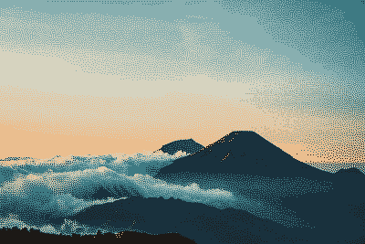

# rscolorq
[](https://travis-ci.com/okaneco/rscolorq)
[](https://crates.io/crates/rscolorq)
[](https://docs.rs/rscolorq)



Rust port of Derrick Coetzee's [`scolorq`][scolorq], based on the 1998 paper
"On spatial quantization of color images" by Jan Puzicha, Markus Held, Jens
Ketterer, Joachim M. Buhmann, & Dieter Fellner. *Spatial quantization* is
defined as simultaneously performing halftoning (dithering) and color
quantization (limiting the colors in an image). For more information, visit
[the original implementation's website][scolorq].

The algorithm is excellent for retaining image detail and minimizing visual
distortions for color palettes in the neighborhood of 4, 8, or 16 colors,
especially as the image size is reduced. It combines limiting the color palette
and dithering the image into a simultaneous process as opposed to sequentially
limiting the colors then dithering. Colors are chosen based on their context in
the image, hence the "spatial" aspect of spatial color quantization. As in
[Pointillism][Pointillism], the colors are selected based on their neighbors to
mix as an average illusory color in the human eye.

[scolorq]: http://people.eecs.berkeley.edu/~dcoetzee/downloads/scolorq/
[Pointillism]: https://en.wikipedia.org/wiki/Pointillism#Gallery

To use as a library, add the following to your `Cargo.toml`; add the
`palette_color` feature to enable Lab color quantization.

```toml
[dependencies.rscolorq]
version = "0.1"
default-features = false
```

## Examples

### 1) Mandrill

  
*Top row: Original image, RGB 2 colors*  
*Bottom row: RGB 4 colors, RGB 8 colors*  

```
rscolorq -i mandrill-resize.jpg -o mandrill-rgb2.png -n 2 --auto -s 0 --iters 5
rscolorq -i mandrill-resize.jpg -o mandrill-rgb4.png -n 4 --auto -s 0 --repeats 3
rscolorq -i mandrill-resize.jpg -o mandrill-rgb8.png -n 8 --auto -s 0 --iters 5
```

The `--iters` and `--repeats` options can be used to increase their values over
the default to improve the quality of output. `--auto` sets the dithering
level based on the image size and desired palette size. The `--seed` or `-s`
option sets the random number generator seed; otherwise, it's seeded randomly.

### 2) Palette swatches and fixed palette

Palette swatches can be generated by passing `--op` plus a filename. `--width`
and `--height` can be passed to specify the width and height of the resulting
palette image. The following swatches are the colors that comprise 4 and 8 color
dithered images in the bottom row of the previous image.

  
  

```
rscolorq -i mandrill-resize.jpg --op mandrill-rgb4-pal.png -n 4 --auto -s 0 --repeats 3
rscolorq -i mandrill-resize.jpg --op mandrill-rgb8-pal.png -n 8 --auto -s 0 --iters 5 -p
```

Passing the `--print` or `-p` flag will print the hexadecimal colors to the
terminal as seen in the second example above. If no `--output` or `-o` is
passed, the dithered image will not be saved to a file.

```
b5c970,191821,b7cbe7,6d7f7b,5db7f0,4e5936,f05131,939bcc
```

Dithering can be performed with fixed palette colors passed by `--colors` or
`-c`.

  
*Original image on the left, fixed palette on the right.*

```
rscolorq -i scenic.jpg -o mountain-pal.png -c FFBF82,09717E --auto -s 0 --iters 5`
```

### 3) Gradients

  
*Top row: Original image, RGB 4 colors, RGB 8 colors.*  
*Bottom row: Lab 4 colors, Lab 8 colors.*  

```
rscolorq -i rainbow.png -o rainbow-rgb4.png -n 4
rscolorq -i rainbow.png -o rainbow-rgb8.png -n 8 --iters 8 --repeats 2
rscolorq -i rainbow.png -o rainbow-lab4.png -n 4 --lab
rscolorq -i rainbow.png -o rainbow-lab8.png -n 8 --lab --iters 8 --repeats 2
```

  
*Left to right: Original image, 2 colors filter size 3, 2 colors filter size 5.*

## Features
- use RGB or Lab color space for calculations
- option to dither based on fixed color palette supplied by the user
- seedable RNG for reproducible results
- print the palette colors to the command line in hexadecimal
- create a palette swatch image from the dither colors

## Limitations

### It's "slow"
- Larger images or images with smooth transitions/gradients will take longer.
Higher palette sizes will take longer.
- The algorithm is suited towards retaining detail with smaller color palettes.
You can still use it on larger images but be aware it's not close to real-time
unless the image is small.

### Filter size 1x1
- Doesn't produce an image resembling the input, nor does the original.

### Filter size 5x5
- Doesn't always converge.
- I'm unsure if this is an error in this implementation or a problem with the
random number generator being used. The original implementation may take a while
but eventually completes with filter size 5.
- *Any help on this would be appreciated.*

## Troubleshooting
If you get an invalid color error or hex color length error with the command
line tool, try enclosing the color string in quotes.

For example, instead of `-c 000000,ffffff` use `-c '000000,ffffff'`.

## License
This crate is licensed under either
- the [MIT License](LICENSE-MIT), or
- the [Apache License (Version 2.0)](LICENSE-APACHE)

at your option.

*Copyright of the original images is property of their respective owners.*
